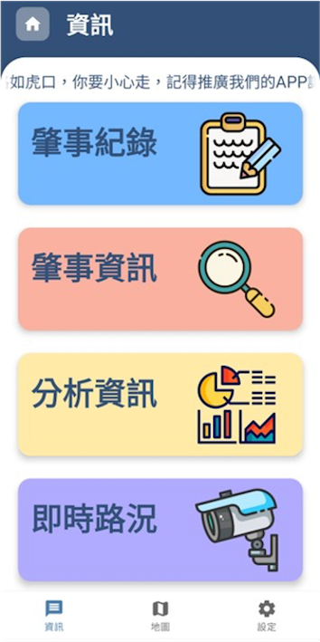
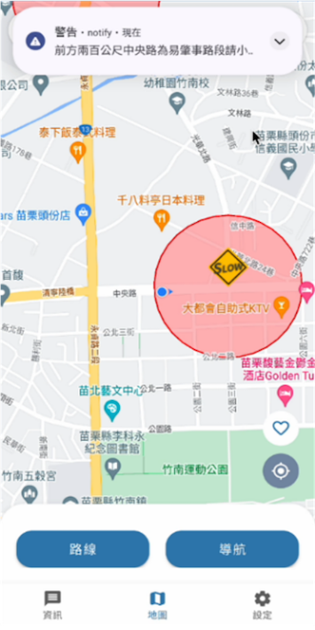
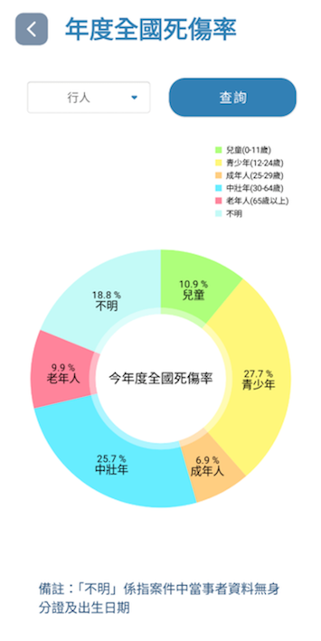
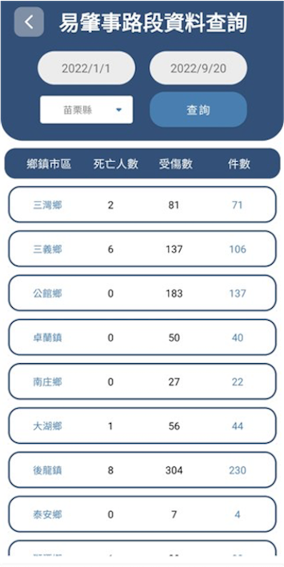

# 🚗 即時道路安全警示系統 | Real-Time Road Warning App

<p align="center">
  
  
  
  
</p>

<p align="center">
  <b>基於 Geofencing 技術的即時道路安全警示 Android 應用，整合 Google Maps 易肇事路段標註、語音播報警告、智慧路線規劃、全國交通事故數據視覺化分析</b>
</p>

---

## 📸 系統預覽

<table align="center">
  <tr>
    <td width="50%">
      
      <p align="center"><em>App 主頁</em></p>
    </td>
    <td width="50%">
      
      <p align="center"><em>Geofence 觸發通知警告</em></p>
    </td>
  </tr>
  <tr>
    <td width="50%">
      
      <p align="center"><em>全國事故數據統計圖表</em></p>
    </td>
    <td width="50%">
      
      <p align="center"><em>肇事紀錄統計</em></p>
    </td>
  </tr>
</table>

---

## ✨ 功能特色

| 功能 | 描述 |
|------|------|
| 🛡️ **即時危險路段警示** | Geofencing 技術偵測進入易肇事區域，自動觸發高優先級通知與語音播報 |
| 🗺️ **互動式地圖介面** | Google Maps SDK 整合，Marker Clustering 聚合顯示全台易肇事地點 |
| 🗣️ **TTS 語音播報** | Android TextToSpeech 引擎，中文語音即時播報前方危險路段資訊 |
| 📊 **事故數據視覺化** | 圓餅圖/折線圖/長條圖三維度分析全國交通事故趨勢 |
| 🧭 **智慧路線規劃** | Google Directions API 路線規劃，區分汽車/機車路線策略 |
| 📍 **常用地址管理** | 儲存常用目的地，一鍵導航至收藏地點 |
| 🔋 **省電模式** | 動態切換 GPS 精度，平衡定位準確度與電池續航 |

---

## 🏗️ 系統架構

```
┌─────────────────────────────────────────────────────────────────┐
│                     Android Application Layer                   │
│                  (MVVM Architecture Pattern)                    │
└─────────────────────────────────────────────────────────────────┘
                                │
            ┌───────────────────┼───────────────────┐
            ▼                   ▼                   ▼
┌───────────────────┐ ┌─────────────────┐ ┌─────────────────────┐
│    UI Layer       │ │  Service Layer  │ │  Broadcast Layer    │
│ ┌───────────────┐ │ │ ┌─────────────┐ │ │ ┌─────────────────┐ │
│ │  Activities   │ │ │ │   Fused     │ │ │ │   Geofence      │ │
│ │  (17 screens) │ │ │ │  Location   │ │ │ │   Broadcast     │ │
│ ├───────────────┤ │ │ │  Service    │ │ │ │   Receiver      │ │
│ │  Fragments    │ │ │ └─────────────┘ │ │ ├─────────────────┤ │
│ │  (Map/Info/   │ │ │ ┌─────────────┐ │ │ │   Network       │ │
│ │   Settings)   │ │ │ │  Location   │ │ │ │   Change        │ │
│ ├───────────────┤ │ │ │  Callback   │ │ │ │   Receiver      │ │
│ │  ViewModels   │ │ │ └─────────────┘ │ │ └─────────────────┘ │
│ └───────────────┘ │ └─────────────────┘ └─────────────────────┘
└───────────────────┘
            │                   │                   │
            └───────────────────┼───────────────────┘
                                ▼
┌─────────────────────────────────────────────────────────────────┐
│                        Utils Layer                              │
│  ┌──────────────┐  ┌──────────────┐  ┌────────────────────┐    │
│  │  Geofence    │  │  Direction   │  │  Notification      │    │
│  │  Helper      │  │  Helper      │  │  Util              │    │
│  ├──────────────┤  ├──────────────┤  ├────────────────────┤    │
│  │  TTS Util    │  │  Cluster     │  │  Connection        │    │
│  │  (Voice)     │  │  Renderer    │  │  Detector          │    │
│  └──────────────┘  └──────────────┘  └────────────────────┘    │
└─────────────────────────────────────────────────────────────────┘
                                │
                ┌───────────────┴───────────────┐
                ▼                               ▼
     ┌──────────────────┐       ┌──────────────────┐
     │  Google Maps     │       │   Backend        │
     │  Platform        │       │   PHP Server     │
     │  (Maps / Places /│       │   (Accident      │
     │   Directions /   │       │    Data API)     │
     │   Geocoding)     │       │   *External*     │
     └──────────────────┘       └──────────────────┘
```

---

## 🔧 技術實現重點

### 1. Geofencing 即時危險區域偵測

```java
// 批量建立地理圍欄 - 支援最多 100 個監控點
public List<Geofence> getGeofences(List<ProneAreaModel> proneAreaModels,
                                    float radius, int transitionType) {
    List<Geofence> geofences = new ArrayList<>();
    for (ProneAreaModel proneAreaModel : proneAreaModels) {
        LatLng latLng = proneAreaModel.getLatLng();
        Geofence geofence = new Geofence.Builder()
                .setCircularRegion(latLng.latitude, latLng.longitude, radius)
                .setRequestId(proneAreaModel.getId())
                .setTransitionTypes(transitionType)
                .setLoiteringDelay(5000)
                .setExpirationDuration(Geofence.NEVER_EXPIRE)
                .build();
        geofences.add(geofence);
    }
    return geofences;
}

// 進入危險區域 → 高優先級通知 + 語音警告
switch (transitionType) {
    case Geofence.GEOFENCE_TRANSITION_ENTER:
        notificationUtil.sendHighPriorityNotification("警告", body, MainActivity.class);
        textToSpeechUtil.speak("前方兩百公尺為易肇事路段請小心行駛");
        break;
}
```

**技術亮點：**
- Google Play Services Geofencing API，圓形圍欄精準觸發
- 支援 ENTER/DWELL/EXIT 三種過渡狀態偵測
- BroadcastReceiver 接收系統級地理圍欄事件
- 依據使用者所在縣市動態載入該區域易肇事地點

### 2. Fused Location 自適應定位引擎

```java
public class FusedLocationService {
    private final LocationCallback locationCallback = new LocationCallback() {
        String cityTemp = "";

        @Override
        public void onLocationResult(@NonNull LocationResult locationResult) {
            for (Location location : locationResult.getLocations()) {
                locationListener.onLocationUpdated(location);
                // 反向地理編碼偵測城市變更 → 重新載入地理圍欄
                String city = getGeoLocateCity(latLng);
                if (!cityTemp.equals(city)) {
                    locationListener.onCityChanged(city);
                }
                cityTemp = city;
            }
        }
    };

    // 動態省電切換
    public void setLowPower() {
        stopLocationUpdates();
        locationRequest.setPriority(Priority.PRIORITY_LOW_POWER);
        startLocationUpdates();
    }
}
```

**技術亮點：**
- Fused Location Provider 融合 GPS/WiFi/基地台多源定位
- 每 5~8 秒更新位置，兼顧即時性與電量消耗
- Geocoder 反向地理編碼，自動偵測跨縣市移動
- High Accuracy / Low Power 兩種模式動態切換

### 3. Google Maps 叢集標記與路線規劃

```java
// Marker Clustering - 聚合顯示大量易肇事地點
ClusterManager<AccidentClusterItem> clusterManager =
        new ClusterManager<>(context, googleMap);
ClusterRenderer renderer = new ClusterRenderer(context, googleMap, clusterManager);
clusterManager.setRenderer(renderer);

// 動態繪製路線 + Polyline 解碼
for (RouteModel routeModel : routeModels) {
    PolylineOptions polylineOptions = new PolylineOptions()
            .geodesic(true)
            .color(Color.BLUE)
            .width(10);
    for (LatLng point : routeModel.getPoints()) {
        polylineOptions.add(point);
    }
    mMap.addPolyline(polylineOptions);
}
```

**技術亮點：**
- Maps Utils Clustering 處理 100+ 標記，避免地圖卡頓
- 自訂 ClusterRenderer，危險區域以紅色圓形視覺化呈現
- Google Directions API 路線規劃，支援汽車/機車不同路線策略
- Encoded Polyline 解碼演算法，精準繪製導航路徑

---

## 🛠️ 技術棧

| 類別 | 技術 |
|------|------|
| **平台** | Android (minSDK 26 / targetSDK 32)，Java 1.8 |
| **架構模式** | MVVM (ViewModel + LiveData + ViewBinding) |
| **地圖與定位** | Google Maps SDK, Places API, Directions API, Fused Location Provider |
| **地理圍欄** | Google Play Services Geofencing API |
| **網路通訊** | OkHttp 5.0, Gson |
| **資料視覺化** | MPAndroidChart (Pie/Line/Bar Chart) |
| **UI 框架** | Material Design, ConstraintLayout, Navigation Component |
| **語音引擎** | Android TextToSpeech (TTS) |
| **後端** | PHP + MySQL（需自行建置，本專案僅含 Android 端） |

---

## 📦 專案結構

```
RealTimeRoadWarningApp/
├── app/src/main/java/.../realtimeroadwarningapp/
│   ├── ui/
│   │   ├── activities/
│   │   │   ├── MainActivity.java             # 🏠 主頁面 + Bottom Navigation
│   │   │   ├── SplashActivity.java           # 🚀 啟動頁 + 權限請求
│   │   │   ├── MapsActivity.java             # 🗺️ 全螢幕地圖
│   │   │   ├── AccidentInfoActivity.java     # 📋 事故資料查詢
│   │   │   ├── AccidentRecordActivity.java   # 📝 事故通報表單
│   │   │   ├── AnalysisInfoActivity.java     # 📊 數據分析入口
│   │   │   ├── DrivingTypeActivity.java      # 🚗 車種選擇
│   │   │   ├── WarningDistanceActivity.java  # 📏 警告距離設定
│   │   │   ├── CommonAddressActivity.java    # 📍 常用地址管理
│   │   │   ├── FeedbackActivity.java         # 💬 意見回饋
│   │   │   └── chart/
│   │   │       ├── PieChartActivity.java     # 🥧 年齡層死傷比例圓餅圖
│   │   │       ├── LineChartActivity.java    # 📈 月份死傷趨勢折線圖
│   │   │       └── BarChartActivity.java     # 📊 縣市事故統計長條圖
│   │   └── fragments/
│   │       ├── map/MapsFragment.java         # 🗺️ 地圖核心 Fragment (753 行)
│   │       ├── info/InfoFragment.java        # ℹ️ 功能資訊頁
│   │       └── settings/SettingsFragment.java # ⚙️ 設定頁面
│   ├── service/
│   │   └── FusedLocationService.java         # 📡 GPS 定位服務
│   ├── broadcast/
│   │   ├── GeofenceBroadcastReceiver.java    # 🛡️ 地理圍欄事件接收
│   │   └── NetworkChangeBroadcastReceiver.java # 📶 網路狀態監聽
│   ├── model/                                # 📦 資料模型 (8 classes)
│   │   ├── ProneAreaModel.java               #    易肇事區域
│   │   ├── AccidentModel.java                #    事故統計
│   │   ├── RouteModel.java                   #    導航路線
│   │   └── CommonAddressModel.java           #    常用地址
│   ├── adapter/                              # 🔌 RecyclerView 適配器
│   ├── utils/
│   │   ├── GeofenceHelper.java               # 🛡️ 地理圍欄工具
│   │   ├── DirectionHelper.java              # 🧭 路線規劃工具
│   │   ├── NotificationUtil.java             # 🔔 高優先級通知
│   │   ├── TextToSpeechUtil.java             # 🗣️ 語音播報工具
│   │   └── cluster/                          # 📍 地圖標記叢集
│   │       ├── AccidentClusterItem.java
│   │       └── ClusterRenderer.java
│   └── LocationListener.java                # 📡 位置回呼介面
├── res/
│   ├── layout/                               # 30+ XML 佈局檔案
│   ├── drawable/                             # 70+ 圖形資源
│   ├── navigation/                           # Navigation Graph
│   └── values/                               # 繁體中文在地化
└── AndroidManifest.xml                       # 權限與元件宣告
```

---

## 🚀 快速開始

### 環境需求

- Android Studio Arctic Fox 以上
- JDK 1.8+
- Android SDK 32
- Google Play Services

### 建置與執行

```bash
# Clone 專案
git clone https://github.com/burinexovo/realtime-road-warning-app.git
cd realtime-road-warning-app

# 使用 Android Studio 開啟專案，等待 Gradle Sync 完成

# 或使用命令列建置
./gradlew assembleDebug
```

### 設定 API Key

1. 取得 [Google Maps API Key](https://console.cloud.google.com/)
2. 啟用以下 API：
   - Maps SDK for Android
   - Places API
   - Directions API
   - Geocoding API
3. 在 `local.properties` 中設定：

```properties
MAPS_API_KEY=your_google_maps_api_key
```

### 設定後端伺服器

> 後端不包含在此專案中，需自行建置 PHP + MySQL 伺服器，詳見 [後端 API 端點](#-後端-api-端點)。

```bash
# 修改 res/values/strings.xml 中的伺服器位址
<string name="ip">http://your-server-ip:8080/RealTimeRoadWarning/</string>
```

### 必要權限

應用程式需要以下 Android 權限：

| 權限 | 用途 |
|------|------|
| `ACCESS_FINE_LOCATION` | 高精度 GPS 定位 |
| `ACCESS_COARSE_LOCATION` | 網路輔助定位 |
| `ACCESS_BACKGROUND_LOCATION` | 背景持續定位 (Android 10+) |
| `INTERNET` | API 資料存取 |
| `ACCESS_NETWORK_STATE` | 網路狀態偵測 |

---

## 📊 後端 API 端點

> 後端服務不包含在此專案中，需依下列 API 規格自行建置（PHP + MySQL）。

| 端點 | 說明 | 參數 |
|------|------|------|
| `accident_prone_area.php` | 取得全台易肇事地點座標 | - |
| `accident_info.php` | 查詢事故統計資料 | `fromDate`, `toDate`, `city` |
| `accident_info_pie_chart.php` | 依車種查詢年齡層死傷比例 | `carType` (行人/自行車/機車/汽車) |
| `accident_info_line_chart.php` | 月份死傷趨勢資料 | - |
| `accident_info_bar_chart.php` | 縣市事故統計資料 | - |

---

## 📈 系統規格

| 指標 | 數值 |
|------|------|
| 定位更新頻率 | 5~8 秒 / 次 |
| 地理圍欄上限 | 100 個同時監控點 |
| 警告觸發距離 | 200m / 500m / 1000m (可配置) |
| 支援 Android 版本 | 8.0 Oreo (API 26) 以上 |
| 覆蓋範圍 | 全台 22 縣市 |
| Java 原始碼 | 49 classes, ~5000+ 行 |

---

## 🔮 未來規劃

- [ ] 即時路況整合 (交通部 TDX API)
- [ ] 事故熱力圖 (Heatmap Layer)
- [ ] 機器學習事故風險預測模型
- [ ] 多語系支援 (English / 日本語)
- [ ] 社群回報功能 (即時路況共享)
- [ ] Android Auto 車載整合

---

## 👥 開發資訊

**國立聯合大學 資訊管理學系 畢業專題**

本人擔任主要開發者，負責系統架構設計與核心功能實作（Geofencing 引擎、地圖整合、定位服務、資料視覺化等）。

團隊成員：劉猷聖、王昱淇、賴昱丞、羅珮禎、劉晏沄、鍾凱

---

## 📄 授權

MIT License - 詳見 [LICENSE](LICENSE)

---

<p align="center">
  <sub>Built with ❤️ using Java, Google Maps Platform, and MPAndroidChart</sub>
</p>
